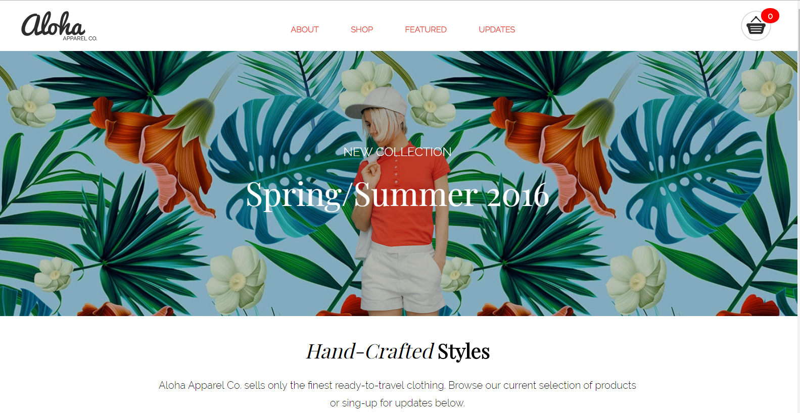

# ALOHA APPAREL CO. - RED ACADEMY PROJECT 1 - WS WEBDEV PROGRAM

# Project Summary

 This project was focused on building a responsive demo homepage called Aloha Apparel Co. It was built
 to accommodate the different viewing sizes such as mobile, tablet, and desktop versions. Towards the end, I implemented
 Javascript components for finishing touches.
 
## Screenshots Desktop & Mobile

## Technologies Used

* HTML
* Javascript
* jQuery
* Flickity
* CSS
* Terminal/Command Line
* Git/GitHub

### Summary of what I learned
* It is important to create a mobile-first css framework and then expand from there
* Using JQuery/Javascript to implement functionality
* Using flex css to neatly organize the layout of the page, while not relying on a third-party css framework
* Having multiple components in compartments made it easier to change the text and images; e.g., responsive header.
